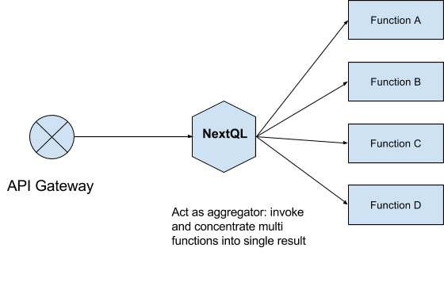
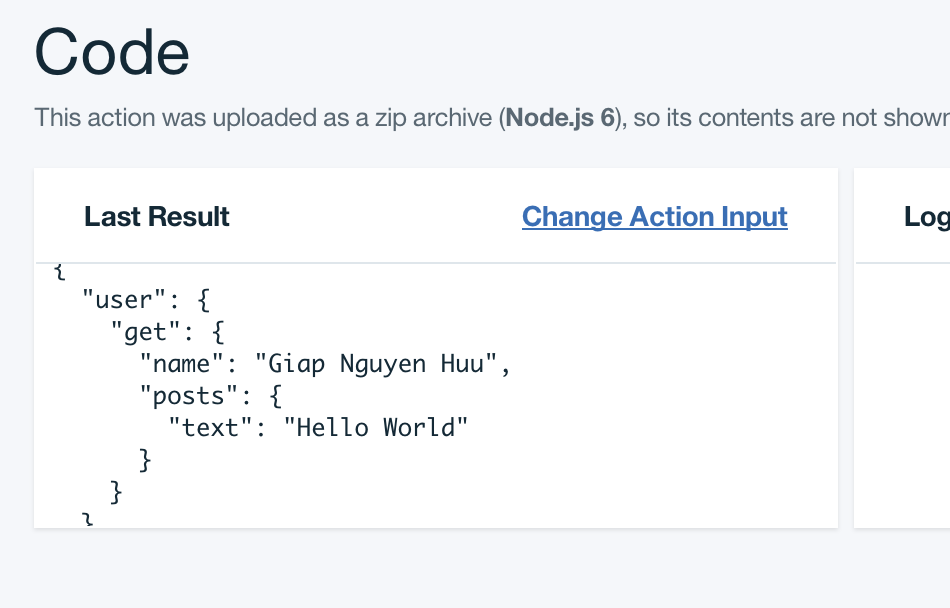

# nextql-serverless
NextQL Plugin for serverless
> Currently only test with Bluemix/openwhisk. More features will coming...

## Why?
NextQL use as function in serverless cloud.


NextQL could serve as Aggregator which invoke and concentrates many functions into single result. Ofcause, NextQL could coerce function' results into graph data based on model definitions.

## Usage
* Bootstrap serverless project please check [the project docs](https://serverless.com/framework/docs/providers/openwhisk/guide/quick-start/)

* Create NextQL function: 
handler.js
```js
function execute(params) {
	var NextQL = require("nextql");
	var nextql = new NextQL();
	var models = require("./models");
	nextql.use(plugin);
	Object.keys(models).forEach(k => nextql.model(k, models[k]));

	return nextql.execute(params).catch(error => {
		console.log(error);
		return error;
	});
}

exports.execute = execute;
```

* Define two model user and post map with 2 existed serverless function "/nextql_nextql/getuser" and "/nextql_nextql/getpost".

```js
module.exports = {
	user: {
		fields: {
			name: 1
		},
		serverless: {
			actions: {
/* map user's method get into function /nextql_nextql/getuser and implicit assign "user" model for function's result */
				get: { 
					name: "/nextql_nextql/getuser" 
					
				}
			},
			computed: {
/* map user's computed posts into function /nextql_nextql/getpost and explicit assign  "post" model for the function result */
				posts: { 
					name: "/nextql_nextql/getpost",
					model: "post" 
				}
			}
		}
	},
	post: { 
		fields: {
			text: 1
		}
	}
};
```
* Create function /nextql_nextql/getuser
```js
function getuser(){
	return { name: "Nguyen Huu Giap" }
}
```

* Create function /nextql_nextql/getpost

```js
function getpost(){
	return { text: "Hello World" }
}
```

* Deploy three function into cloud.

* Invoke execute function with query
```js
{ "user": { 
	"get": { 
		"name": 1, "posts": {"text": 1}  } 
	} 
}
```
result should be



